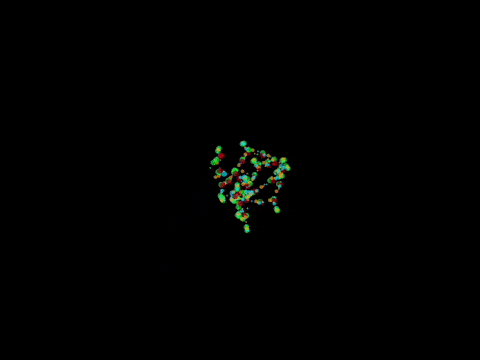

This is a collection of scripts and experiments with chemlambda. 

The active branch is https://github.com/chorasimilarity/chemlambda-gui/tree/gh-pages/dynamic

## Chemlambda

Is an artificial chemistry based on a graph rewrite system and various (random or deterministic) algorithms for applications of rewrites. The graphs in chemlambda are called "molecules" and they are stored as .mol files. Each mol file is a list of nodes, one node/line. Each line is a list of: type of node, port variables. For details see http://chorasimilarity.github.io/chemlambda-gui/dynamic/moves.html 

## Relations with other models of computation

Chemlambda is loosely related to interaction nets, as seen from the rewrite rules. However, the particular choice of nodes and rewrites allows chemlambda to be used for reduction of untyped lambda terms,  solely by local rewrites, which is something new. The second difference between interaction nets and chemlambda is that chemlambda uses as central objects the graphs (molecules), not the lambda terms (or other linguistic constructs). For example, when using interaction nets for the reduction of lambda terms there is a function lambda2graphs which converts a lambda term to a graph, then the graph is reduced as an interaction net, then there is a function graphs2lambda which returns a lambda term from a graph. The accent is at the level of lambda terms, not graphs, because lambda2graphs and graphs2lambda are not one the inverse of the other. The third difference, related to the second, is that chemlambda is not a tool for better understanding lambda calculus, as there is nothing special in the chemlambda formalism which restricts it to molecules coming from lambda terms. On the contrary, one of the interesting class of graphs in chemlambda are "quines", molecules which have a periodic evolution under deterministic reduction algorithms. These chemlambda quines are good proposals for living organisms when reduced randomly. There is nothing similar in interaction nets. 

I am very skeptical about relations to category theory graph rewrites models, because even if the rewrites are common with the interaction nets ones, the class of graphs is more restricted in the category theory approaches. (The short description is that they use graphs with certain embeddings, imposing unnecessary global orders; besides, despite the overwhelming PR, they have not much to say about applications to untyped lambda beta calculus.) 

Another class of relations concerns chemistry like models of computation. The Alchemy of Fontana and Buss comes to mind, as well as the work of Christoph Flamm http://www.tbi.univie.ac.at/~xtof/papers.html . The Alchemy proposes that a chemical reaction is of the type A + B - - > AB, where A, B are lambda terms and AB is A applied to B. Flamm's models are very close to real chemistry. The chemical reactions are of the type A + B - - > C + D, understood as a rewrite of the unconnected pattern obtained from the union of A and B. In chemlambda the rewrites model a chemical reaction A + Enzyme - - > B  + Enzyme, where Enzyme is associated to the rewrite. 

## Applications, long term

There are three possible applications of chemlambda: 
- in real chemistry, for building molecular computers, or for understanding living organisms as molecular computers, see http://chorasimilarity.github.io/chemlambda-gui/dynamic/molecular.html 
- in decentralized computing, because chemlambda with the random reduction algorithm is an asynchronous graph rewrite automaton. 
- both worlds united: see http://chorasimilarity.github.io/chemlambda-gui/dynamic/vision.html for a sketch of the idea to build chemlambda based chemical computers which work both in the virtual and meat spaces. For achieving this goal we need to solve the previous two applications and to use, perhaps, an (open version of) Digital Biological Converter, o fthe kind Craig Venter has already. 

## Related work

- chemlambda-hask https://github.com/synergistics/chemlambda-hask is a Haskell API for graph rewrite systems with animplementation of chemlambda. It has the potential to be a clear and creative product, good for  a stem of a future chemlambda library, for general purpose use.
- chemlambda-yuva https://github.com/YuvaAthur/chemlambda-yuva is a Python implementation of chemlambda adapted from chemlambda-py. I have not checked it yet but I am very intrigued because is related with  this other repository https://github.com/YuvaAthur/nL about experiments in graph rewriting
- LPU https://github.com/MaiaVictor/LPU which is biased towards  interaction networks style, but very interesting to develop more. It introduces the idea to convert the asynchronous graph rewrite system into an asynchronous rewrite system, by using the mol-file like list of nodes for the graph, together with supplementary rewrites (using an automaton of choice) for shuffling this list. The graph rewrites are executed only when the nodes of the pattern are close enough in the list. 

Older: 
-  chemlambda-py https://github.com/4lhc/chemlambda-py is a Python version of chemlambda, which is unfinished because the rewrite A-L is not well written. Maybe a Python afficionado could make it useful, by comparing it with the Haskell version. 

## Fun short term projects

Things I long for: 
- a pure javascript version of chemlambda, make a game based on it? 
- produce a movie (or again a game-like demo) of a living cell, based on chemlambda, see the trailer I made https://vimeo.com/138476341 

## Fun links

See more at
- chemlambda index: http://chorasimilarity.github.io/chemlambda-gui/index.html
- the demos page http://chorasimilarity.github.io/chemlambda-gui/dynamic/demos.html
- the moves and explanations, references http://chorasimilarity.github.io/chemlambda-gui/dynamic/moves.html
- the vision page http://chorasimilarity.github.io/chemlambda-gui/dynamic/vision.html
- the chemlambda collection of more than 250 animated gifs obtained from simulations https://plus.google.com/collection/UjgbX

## How to use what's in there

Follow the steps: 
- download the gh-pages branch of the repo from this link https://github.com/chorasimilarity/chemlambda-gui/archive/gh-pages.zip
- open a terminal window, change directory to the folder "dynamic"
- type "bash quiner_shuffle.sh" for the random rewrites algorithm. Type "bash moving_random_metabo.sh" for deterministic rewrites algorithm. Type "bash quiner_node.sh" for the random colored rewrites algorithm. There are several pairs of scripts, like quiner_shuffle.sh and quiner_shuffle.awk. The parameters (number of cycles, weights of moves, visualisation parameters, see comments in the .awk script) are set by editing the awk script called by the sh script. 
- you shall see the list of all .mol files from the "mol" folder. Each mol file represents a chemlambda molecule. If you want to reproduce a demo, then choose the file.mol which corresponds to the file.html name of the demo page http://chorasimilarity.github.io/chemlambda-gui/dynamic/demos.html 
- a file.html is produced, which you can see with a browser. It is a d3.js animation of the history of the computation. (I use safari for best results, then chrome, then firefox. All the animations from the chemlambda collection have been done by screencasting the file.html result. Sometimes I edit the file.html and play a little with charge, gravity, linkstrength, or with the speed parameter which multiplies the step from the function nextval() definition.)

There is an older gallery of examples, explanations and downloads of the first version of these scripts, at the page http://imar.ro/~mbuliga/gallery.html

See also my channel for short videos about chemlambda https://www.youtube.com/channel/UCO2CcqUKORdyXd_CdgEdvVQ/videos
