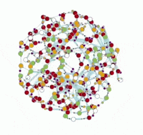

This is a collection of scripts and experiments with chemlambda. 

See more at

-  chemlambda index: http://chorasimilarity.github.io/chemlambda-gui/index.html
-  the demos page http://chorasimilarity.github.io/chemlambda-gui/dynamic/demos.html
-  the moves and explanations, references http://chorasimilarity.github.io/chemlambda-gui/dynamic/moves.html
-  the vision page http://chorasimilarity.github.io/chemlambda-gui/dynamic/vision.html

The active branch, where everything happens, is https://github.com/chorasimilarity/chemlambda-gui/tree/gh-pages/dynamic

How to use what's in there:

 - download the gh-pages branch of the repo from this link https://github.com/chorasimilarity/chemlambda-gui/archive/gh-pages.zip
 - unzip it and go to the folder "dynamic"
 - edit the copy you have of the latest main script  (same for the script quiner.awk)  https://github.com/chorasimilarity/chemlambda-gui/blob/gh-pages/dynamic/check_1_mov2_rand_metabo_bb.awk to change the parameters (number of cycles, weights of moves, visualisation parameters, see comments in the script)
 - use the command “bash moving_random_metabo_bb.sh”    (see what it contains 
https://github.com/chorasimilarity/chemlambda-gui/blob/gh-pages/dynamic/moving_random_metabo_bb.sh ). Alternatively type "bash quiner.sh" if you want to use quiner.awk
- you shall see the list of all .mol files from the “dynamic” folder. If you want to reproduce a demo, or better a new random run of a computation shown in a demo, then choose the file.mol which corresponds to the file.html name of the demo page http://chorasimilarity.github.io/chemlambda-gui/dynamic/demos.html

An explanation of the algorithm embedded in the main script is here

https://chorasimilarity.wordpress.com/2015/04/27/a-short-complete-description-of-chemlambda-as-a-universal-model-of-computation/

but in the latest main script there are additioned new moves for a busy beaver Turing machine, see the explanations in the work in progress

http://chorasimilarity.github.io/chemlambda-gui/dynamic/turingchem.html

See one of the first articles which run in the browser: M. Buliga, Molecular computers (2015) 
http://chorasimilarity.github.io/chemlambda-gui/dynamic/molecular.html

A collection of microblogging posts, with lots of animated gifs, here 
https://plus.google.com/u/0/collection/UjgbX

I use all the time my open notebook https://chorasimilarity.wordpress.com/ for more explanations and details.

Older gallery of examples, explanations and dowloads from the page http://imar.ro/~mbuliga/gallery.html

See also my channel for short videos about chemlambda https://www.youtube.com/channel/UCO2CcqUKORdyXd_CdgEdvVQ/videos
